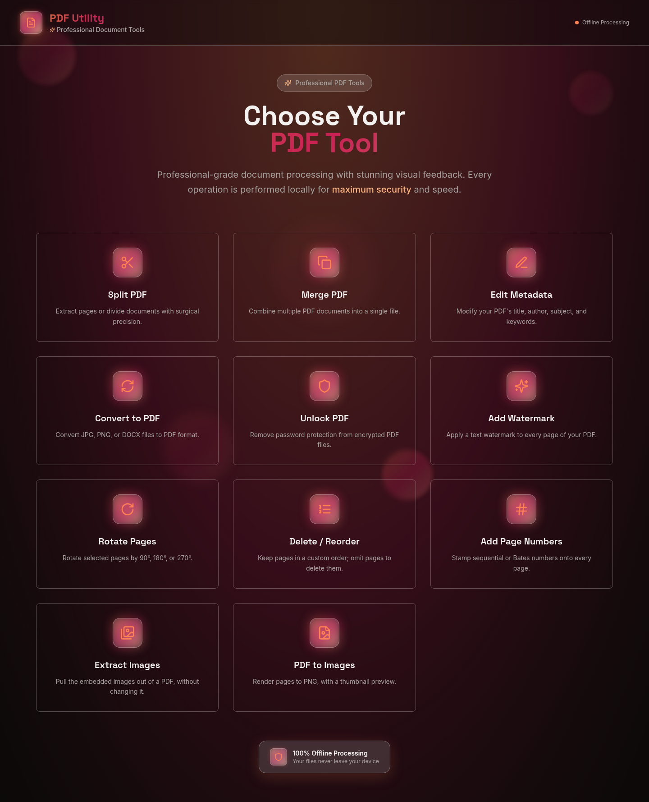

# OffGridPDF

[](https://github.com/sayjavajava/offline-pdf-utility/releases/latest)
[](https://github.com/sayjavajava/offline-pdf-utility/releases)
[](https://github.com/sayjavajava/offline-pdf-utility/stargazers)
[](LICENSE)

An **AI-coded**, completely offline PDF toolkit built with React and TypeScript, featuring a stunning glassmorphism UI. Perform all PDF operations securely in your browser with complete privacy. Runs the same whether you're online or genuinely off the grid — it never asks.

## App Interface



## Features

- **100% Offline**: Your files are never uploaded to a server, ensuring maximum privacy and security.
- **Modern UI**: A beautiful and intuitive glassmorphism interface built with the Lovable UI framework.
- **Split PDF**: Extract specific pages or page ranges from a PDF, either as one combined file or
  as a zip of individual per-page PDFs.
- **Merge PDF**: Combine multiple PDF documents into a single file.
- **Unlock PDF**: Remove password protection from an encrypted PDF, given its
  password. Supports both RC4 and AES encryption.
- **Protect PDF**: Add a password to a PDF, encrypted with AES-256, so only someone who knows
  it can open the file. Optionally restrict printing, copying, or editing with a separate
  permissions password — a distinct password is required, since PDF readers grant full,
  unrestricted access to anyone who supplies the same one used to open the file.
- **Edit Metadata**: Modify your PDF's title, author, subject, and keywords.
- **Convert to PDF**: Convert JPEG, PNG, or DOCX files to PDF format, with genuinely selectable,
  searchable text for DOCX — not a rasterized image of the page. Select several images at once to
  combine them into one multi-page PDF, in the order you choose.
- **Add Watermark**: Apply a text watermark to every page of your PDF.
- **Rotate Pages**: Rotate selected pages (or the whole document) by 90°, 180°, or 270°.
- **Delete / Reorder Pages**: Keep pages in a custom order; omit pages to delete them.
- **Add Page Numbers**: Stamp sequential page numbers, "page x of y", or zero-padded Bates
  numbers (with an optional prefix) for legal documents.
- **Extract Images**: Pull the embedded images out of a PDF without modifying it; several
  images are bundled into a zip.
- **PDF to Images**: Render pages to PNG at a chosen scale, with a thumbnail preview so you
  can see the pages before choosing a range.
- **Extract Text**: Pull the text out of a PDF as a plain text file. Scanned documents have no
  text layer and will come back empty — reading those needs OCR, which this tool does not do.
- **Compress PDF**: Shrink a PDF by recompressing its embedded images and content streams —
  mainly effective on image-heavy documents.
- **Crop / Resize Pages**: Trim margins non-destructively (content is untouched, only the
  visible window shrinks), or rescale pages to a target paper size with content scaled
  proportionally to fit.
- **Redact PDF**: Draw boxes over content to permanently delete it — the underlying text and
  image data is removed, not just painted over, so nothing under a box stays selectable,
  copyable, or searchable.

Handles real-world large documents well — see [`docs/PERFORMANCE.md`](docs/PERFORMANCE.md) for
measured results on hundreds of pages and tens of MB, not just estimates.

## How to Use

This tool is designed to be simple and intuitive. All processing happens directly in your browser, ensuring your files remain private.

1.  **Open the Application**: Access OffGridPDF through the provided live URL or by running it locally (see [Setup and Development](#setup-and-development)).
2.  **Choose a Tool**: From the main dashboard, click on the tool you need, such as "Split PDF" or "Add Watermark".
3.  **Follow the Steps**: Each tool will present you with simple options. This usually involves:
    *   Uploading your PDF or image file(s).
    *   Filling in any required fields (like page numbers for splitting or text for a watermark).
4.  **Process Your File**: Click the main action button for the tool.
5.  **Download Your File**: Your new, modified file will be automatically downloaded by your browser.

That's it! No complex steps, just a straightforward tool for your PDF needs.

## Offline Usage (No Internet Required)

For a truly offline experience, you can run this application without any internet connection, not even for the first time.

### For Developers (Creating the Offline Version)

1.  **Build the application**:

    ```bash
    npm run build
    ```

2.  **Ship `dist/offgridpdf.html`**:
    The build produces a single self-contained `dist/offgridpdf.html` with all
    JavaScript, CSS, and fonts inlined. That one file *is* the application —
    there is nothing else to package, and no `.zip` is needed.

    This is deliberate. Browsers treat a page opened from disk as having a
    `null` origin and fetch module scripts and fonts under CORS rules, so a
    conventional multi-file build silently refuses to start from `file://`.
    Inlining every asset is what makes opening the file directly work at all.

### For End-Users

1.  **Get the file**: Download `offgridpdf.html` from the
    [Releases page](../../releases).
2.  **Verify it** (optional, but the point of publishing a checksum): each
    release also carries `SHA256SUMS.txt`. Confirm your copy matches before you
    trust it —

    ```bash
    sha256sum offgridpdf.html                    # Linux
    shasum -a 256 offgridpdf.html                # macOS
    CertUtil -hashfile offgridpdf.html SHA256    # Windows
    ```

    The published file is the exact artifact CI built and checked, not a later
    rebuild, so a matching hash means you are running the code that passed the
    offline checks below.
3.  **Open it**: Double-click it, or open it in your browser. That's it.

The application runs entirely from your machine, with no network access at
any point — you can verify this by disconnecting before you open it.

### How that promise is kept

"Offline" is enforced by CI on every push, not just asserted here:

- `npm run check:offline` fails the build if `dist/` is anything other than one
  self-contained page, or if that page contains a reference the browser would
  fetch (a `<script src>`, `<link href>`, CSS `url()` or `@import` pointing off
  the machine).
- `npm run check:offline:runtime` loads the real built file from disk in a
  headless browser **with every non-local request blocked**, opens all tools,
  renders a PDF, and fails if a single request was attempted.

The runtime check is the load-bearing one: static analysis cannot see a URL
assembled at run time, nor tell a bundled library's unused network code from
code that actually runs. Both were confirmed to fail when a CDN font link was
deliberately reintroduced, so they are known to catch the regression they
exist to prevent.

Your files are never uploaded because there is nowhere to upload them to: the
app has no server component, and no `fetch`, `XMLHttpRequest`, `WebSocket` or
telemetry of its own.

Being offline is also why pdf.js's predefined CMap tables are compiled into the
build (`scripts/generate-cmaps.mjs`, run automatically on install). PDFs that
use a predefined CMap encoding — common in Chinese, Japanese and Korean
documents — cannot be drawn without them, and a file opened from disk has no
way to fetch them. They are generated from the installed pdfjs-dist rather than
committed, so they cannot drift out of step with it on an upgrade.

## Technologies

- **React** + **TypeScript** + **Vite** — application, types, and build.
- **@cantoo/pdf-lib** — reading and writing PDFs. A maintained fork of `pdf-lib`, used because it
  implements the standard security handler and can therefore open password-protected documents,
  which upstream cannot.
- **pdf.js** — rasterising pages for the thumbnail previews, PNG export, and redaction. The
  *legacy* build is used deliberately, since the modern one relies on a JavaScript feature not yet
  in every browser.
- **qpdf**, compiled to WASM — encrypting PDFs (writing a password, which neither pdf-lib nor its
  fork can do) and recompressing them. Loaded via a base64 `data:` URI built from the bundled
  binary, so it runs with zero network requests even though its own loader only knows how to
  `fetch()` a sibling file.
- **mammoth.js** — parses DOCX into HTML, which a custom layout engine then lays out directly onto
  a PDF page via pdf-lib — genuinely selectable, searchable text, not a rasterized image.
- **Tailwind CSS** + **shadcn/ui** (Radix) — styling and the handful of UI primitives still in use.
- **Vitest** + **React Testing Library** — the test suite.

Heavy PDF work runs in a Web Worker so the interface stays responsive; both that worker and pdf.js's
are inlined into the build, because a file opened from disk cannot fetch sibling files.

## Setup and Development

This project uses **npm** (see `packageManager` in `package.json`). Do not commit
other lockfiles.

1. **Clone the repository:**
   ```bash
   git clone https://github.com/sayjavajava/offline-pdf-utility.git
   cd offline-pdf-utility
   ```

2. **Install dependencies:**
   ```bash
   npm ci
   ```

3. **Run the development server:**
   ```bash
   npm run dev
   ```

4. **Open the application:**
   Open your browser and navigate to the local URL provided by Vite (usually `http://localhost:5173`).

## License

GPL-3.0-or-later. See [`LICENSE`](LICENSE).

## Contribution Guidelines

We welcome contributions! If you have an idea for a new feature or have found a bug, please open an issue to discuss it. Pull requests are also welcome. Add a bullet to [`CHANGELOG.md`](CHANGELOG.md)'s `## [Unreleased]` section as part of your PR if it's user-facing — see [`RELEASING.md`](RELEASING.md) for the full release process, including what happens to older versions once a new one ships.

## Support

This project is free and always will be — no ads, no telemetry, no paid tiers. If it's useful to you, you can support development via [GitHub Sponsors](https://github.com/sponsors/sayjavajava) or [Buy Me a Coffee](https://buymeacoffee.com/sayjavajava).

## Contact

For any questions or feedback, please reach out via [GitHub Issues](../../issues).
